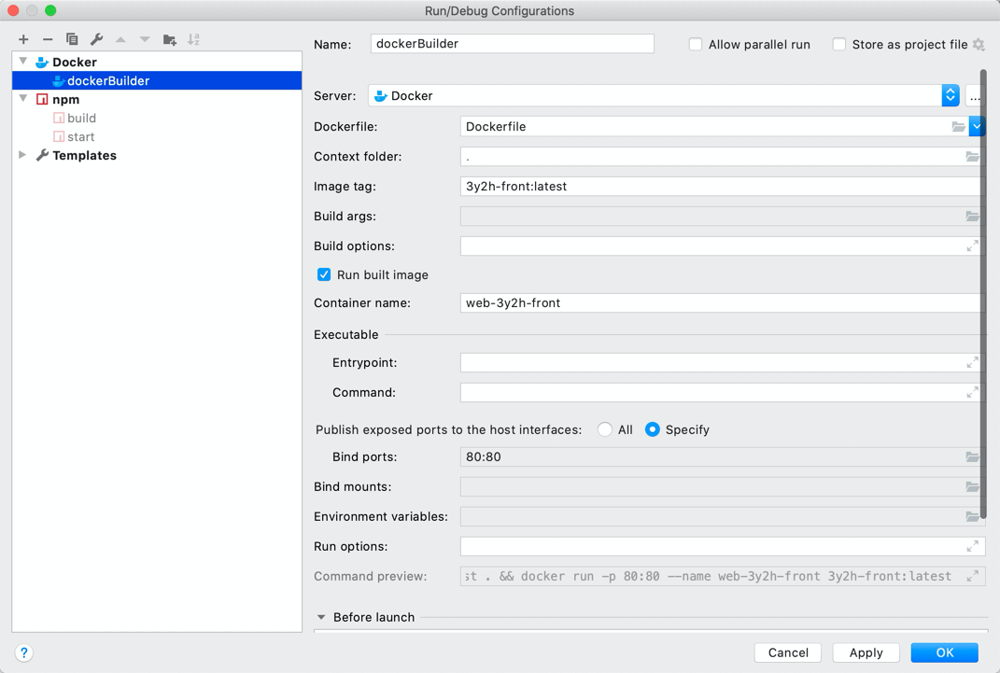

# 3y2h-front

> 3y2h front project

## Build Setup

``` bash
# install dependencies
npm install

# serve with hot reload at localhost:8080
npm run dev

# build for production with minification
npm run build

# build for production and view the bundle analyzer report
npm run build --report
```

## Deploy

``` html
# step 1
npm run build

# step 2
配置dockerfile启动项，运行
```


